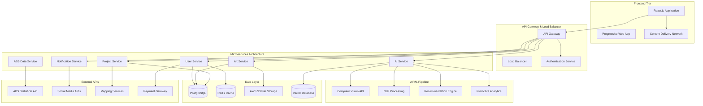

# 🏗️ Technical Architecture & System Design

## High-Level Architecture Overview



## 🌐 Backend Architecture

### Microservices Design Pattern

#### 1. User Service (`/api/users`)
```typescript
// Core User Management
interface UserService {
  // Authentication & Authorization
  POST   /api/users/register
  POST   /api/users/login
  POST   /api/users/logout
  POST   /api/users/refresh-token
  
  // Profile Management
  GET    /api/users/profile
  PUT    /api/users/profile
  POST   /api/users/profile/avatar
  
  // Social Features
  GET    /api/users/artists/network
  POST   /api/users/follow/{artistId}
  DELETE /api/users/unfollow/{artistId}
  
  // Preferences & Settings
  GET    /api/users/preferences
  PUT    /api/users/preferences/ai
  PUT    /api/users/preferences/notifications
}
```

#### 2. Art Service (`/api/art`)
```typescript
interface ArtService {
  // Artwork Submission
  POST   /api/art/submissions
  GET    /api/art/submissions/{id}
  PUT    /api/art/submissions/{id}
  DELETE /api/art/submissions/{id}
  
  // File Management
  POST   /api/art/upload
  GET    /api/art/files/{id}
  DELETE /api/art/files/{id}
  
  // Gallery & Discovery
  GET    /api/art/gallery
  GET    /api/art/search
  GET    /api/art/featured
  GET    /api/art/trending
  
  // Interactions
  POST   /api/art/{id}/favorite
  POST   /api/art/{id}/share
  GET    /api/art/{id}/analytics
}
```

#### 3. Project Service (`/api/projects`)
```typescript
interface ProjectService {
  // Construction Projects
  GET    /api/projects/active
  GET    /api/projects/{id}
  POST   /api/projects/apply/{projectId}
  
  // Location & Mapping
  GET    /api/projects/nearby?lat={lat}&lng={lng}
  GET    /api/projects/region/{regionId}
  
  // Community Engagement
  GET    /api/projects/{id}/community-needs
  POST   /api/projects/{id}/community-feedback
  GET    /api/projects/{id}/impact-metrics
}
```

#### 4. AI Service (`/api/ai`)
```typescript
interface AIService {
  // Art Analysis
  POST   /api/ai/analyze-artwork
  GET    /api/ai/analysis/{id}
  POST   /api/ai/cultural-assessment
  
  // Community Matching
  POST   /api/ai/match-artists
  GET    /api/ai/recommendations/{userId}
  POST   /api/ai/collaboration-score
  
  // Predictive Analytics
  POST   /api/ai/impact-prediction
  GET    /api/ai/social-cohesion-forecast
  POST   /api/ai/community-sentiment
  
  // Training & Learning
  POST   /api/ai/feedback
  GET    /api/ai/model-performance
}
```

## 🗄️ Database Design

### PostgreSQL Schema

```sql
-- Users Table
CREATE TABLE users (
    id BIGSERIAL PRIMARY KEY,
    username VARCHAR(50) UNIQUE NOT NULL,
    email VARCHAR(255) UNIQUE NOT NULL,
    password_hash VARCHAR(255) NOT NULL,
    profile_data JSONB,
    cultural_background TEXT[],
    skills TEXT[],
    interests TEXT[],
    location GEOGRAPHY(POINT, 4326),
    ai_preferences JSONB DEFAULT '{}',
    created_at TIMESTAMP DEFAULT CURRENT_TIMESTAMP,
    updated_at TIMESTAMP DEFAULT CURRENT_TIMESTAMP,
    is_active BOOLEAN DEFAULT TRUE
);

-- Artworks Table
CREATE TABLE artworks (
    id BIGSERIAL PRIMARY KEY,
    user_id BIGINT REFERENCES users(id),
    project_id BIGINT REFERENCES projects(id),
    title VARCHAR(255) NOT NULL,
    description TEXT,
    artist_statement TEXT,
    cultural_elements TEXT[],
    file_urls TEXT[],
    ai_analysis JSONB,
    social_impact_score DECIMAL(3,2),
    cultural_sensitivity_score DECIMAL(3,2),
    status VARCHAR(50) DEFAULT 'draft',
    submission_date TIMESTAMP,
    approval_date TIMESTAMP,
    created_at TIMESTAMP DEFAULT CURRENT_TIMESTAMP
);

-- Projects Table  
CREATE TABLE projects (
    id BIGSERIAL PRIMARY KEY,
    name VARCHAR(255) NOT NULL,
    description TEXT,
    location GEOGRAPHY(POINT, 4326),
    address TEXT,
    region VARCHAR(100),
    start_date DATE,
    end_date DATE,
    budget_range VARCHAR(50),
    community_demographics JSONB,
    requirements TEXT[],
    status VARCHAR(50) DEFAULT 'active',
    created_at TIMESTAMP DEFAULT CURRENT_TIMESTAMP
);

-- AI Analysis Results
CREATE TABLE ai_analysis (
    id BIGSERIAL PRIMARY KEY,
    artwork_id BIGINT REFERENCES artworks(id),
    analysis_type VARCHAR(50),
    results JSONB NOT NULL,
    confidence_score DECIMAL(3,2),
    model_version VARCHAR(50),
    processing_time_ms INTEGER,
    created_at TIMESTAMP DEFAULT CURRENT_TIMESTAMP
);

-- Artist Collaborations
CREATE TABLE collaborations (
    id BIGSERIAL PRIMARY KEY,
    artist1_id BIGINT REFERENCES users(id),
    artist2_id BIGINT REFERENCES users(id),
    project_id BIGINT REFERENCES projects(id),
    collaboration_type VARCHAR(50),
    ai_match_score DECIMAL(3,2),
    status VARCHAR(50) DEFAULT 'proposed',
    created_at TIMESTAMP DEFAULT CURRENT_TIMESTAMP,
    UNIQUE(artist1_id, artist2_id, project_id)
);
```

### Redis Caching Strategy

```typescript
interface RedisSchema {
  // Session Management
  "session:{sessionId}": UserSession;
  "user:{userId}:profile": UserProfile;
  
  // AI Model Caching
  "ai:analysis:{artworkHash}": AIAnalysisResult;
  "ai:recommendations:{userId}": RecommendationList;
  
  // Performance Caching
  "projects:active": Project[];
  "gallery:featured": Artwork[];
  "stats:community_impact": CommunityMetrics;
  
  // Rate Limiting
  "ratelimit:{userId}:{endpoint}": RequestCount;
  "ratelimit:{ip}:{endpoint}": RequestCount;
}
```

## 🔄 Data Flow Architecture

### Real-time Data Processing
```typescript
// Event-Driven Architecture
interface DataFlow {
  // Artwork Upload Flow
  "artwork.uploaded" -> [
    AI_ANALYSIS_QUEUE,
    CONTENT_MODERATION_QUEUE,
    THUMBNAIL_GENERATION_QUEUE
  ];
  
  // AI Analysis Complete
  "ai.analysis.complete" -> [
    NOTIFICATION_SERVICE,
    RECOMMENDATION_UPDATE,
    IMPACT_METRICS_UPDATE
  ];
  
  // Community Interaction
  "artwork.favorited" -> [
    RECOMMENDATION_RETRAIN,
    ARTIST_ENGAGEMENT_METRICS
  ];
  
  // Project Updates
  "project.status.changed" -> [
    NOTIFY_SUBSCRIBED_ARTISTS,
    UPDATE_AVAILABILITY_INDEX
  ];
}
```

### External API Integration

#### Australian Bureau of Statistics (ABS)
```typescript
class ABSDataService {
  private baseUrl = 'https://api.abs.gov.au/data';
  
  async fetchEducationMetrics(region: string): Promise<EducationData> {
    const endpoint = `/education-work/may-2024/${region}`;
    return this.authenticatedRequest(endpoint);
  }
  
  async fetchEmploymentData(postcode: string): Promise<EmploymentData> {
    const endpoint = `/labour-force/${postcode}`;
    return this.authenticatedRequest(endpoint);
  }
  
  async fetchSocialCohesionMetrics(): Promise<SocialCohesionData> {
    // Integration with Scanlon Institute data
    const endpoint = `/social-cohesion/latest`;
    return this.authenticatedRequest(endpoint);
  }
}
```

#### Geospatial Services
```typescript
class GeospatialService {
  async findNearbyProjects(
    latitude: number, 
    longitude: number, 
    radius: number = 50
  ): Promise<Project[]> {
    const query = `
      SELECT p.*, 
             ST_Distance_Sphere(p.location, ST_MakePoint($2, $1)) as distance
      FROM projects p 
      WHERE ST_DWithin(p.location, ST_MakePoint($2, $1), $3)
      AND p.status = 'active'
      ORDER BY distance ASC
    `;
    
    return db.query(query, [latitude, longitude, radius * 1000]);
  }
}
```

## 🚀 Scalability & Performance

### Horizontal Scaling Strategy
```yaml
# Kubernetes Deployment Example
apiVersion: apps/v1
kind: Deployment
metadata:
  name: ai-service
spec:
  replicas: 3
  selector:
    matchLabels:
      app: ai-service
  template:
    metadata:
      labels:
        app: ai-service
    spec:
      containers:
      - name: ai-service
        image: artaura/ai-service:v2.1
        resources:
          requests:
            memory: "2Gi"
            cpu: "1000m"
            nvidia.com/gpu: 1
          limits:
            memory: "4Gi" 
            cpu: "2000m"
            nvidia.com/gpu: 1
```

### Caching Strategy
- **Level 1**: Browser caching for static assets (24h)
- **Level 2**: CDN caching for images and files (7 days)
- **Level 3**: Redis application caching (1-24h depending on data type)
- **Level 4**: Database query result caching (5-60 minutes)

### Monitoring & Observability
```typescript
interface SystemMetrics {
  // Performance Metrics
  api_response_time: Histogram;
  ai_processing_time: Histogram;
  database_query_time: Histogram;
  
  // Business Metrics
  daily_active_users: Counter;
  artworks_analyzed_daily: Counter;
  successful_artist_matches: Counter;
  community_engagement_score: Gauge;
  
  // System Health
  error_rate: Counter;
  memory_usage: Gauge;
  gpu_utilization: Gauge;
  queue_depth: Gauge;
}
```

## 🔒 Security Architecture

### Multi-Layer Security
```typescript
interface SecurityLayers {
  // API Security
  authentication: "JWT + Refresh Tokens";
  authorization: "RBAC with fine-grained permissions";
  rate_limiting: "Token bucket algorithm per user/IP";
  
  // Data Security
  encryption_at_rest: "AES-256";
  encryption_in_transit: "TLS 1.3";
  sensitive_data: "Vault encryption for PII";
  
  // AI Model Security
  model_versioning: "Immutable model artifacts";
  input_validation: "Schema validation + sanitization";
  output_filtering: "Bias detection + content moderation";
}
```

## 📈 Dataset-Driven API Endpoints

### Intelligent API Responses Using Dataset Insights
```typescript
interface DatasetPoweredAPIs {
  // ABS Data-Enhanced Artist Matching
  '/api/ai/enhanced-artist-matching': {
    method: 'POST',
    data_sources: ['ABS_skills_development', 'ABS_employment_opportunities'],
    ai_processing: 'Skills gap analysis + employment trend prediction',
    response_enhancement: 'Career pathway recommendations based on regional employment data'
  };
  
  // Social Cohesion-Informed Community Matching  
  '/api/ai/community-impact-optimization': {
    method: 'POST',
    data_sources: ['Scanlon_social_cohesion', 'ABS_demographic_data'],
    ai_processing: 'Community harmony analysis + cultural bridge identification',
    response_enhancement: 'Socially optimal artist-community pairings'
  };
  
  // Economic Impact Prediction API
  '/api/ai/economic-impact-forecast': {
    method: 'POST',  
    data_sources: ['ABS_job_opportunities', 'ABS_education_work', 'project_outcome_history'],
    ai_processing: 'Economic modeling + employment impact prediction',
    response_enhancement: 'ROI forecasting for art projects with employment benefits'
  };
  
  // Training Opportunity Recommendations
  '/api/ai/personalized-training-pathways': {
    method: 'GET',
    data_sources: ['ABS_work_related_training', 'individual_skill_assessment'],
    ai_processing: 'Skill gap analysis + training effectiveness prediction',
    response_enhancement: 'Personalized professional development roadmaps'
  };
}
```

### Real-Time Dataset API Integration

#### Live Data Processing for Agentic Decision Making
```python
class RealTimeDataProcessingEngine:
    def __init__(self):
        self.data_streams = {
            'abs_education': ABSEducationStream(),
            'abs_employment': ABSEmploymentStream(),
            'scanlon_cohesion': ScanlorSocialCohesionStream(),
            'community_sentiment': SocialMediaSentimentStream(),
            'project_performance': ProjectOutcomeStream()
        }
        
    async def real_time_agent_data_feeding(self):
        """
        Continuous data streaming to agentic AI for real-time decision making
        """
        async for data_batch in self.aggregate_real_time_streams():
            # Process and validate incoming data
            validated_data = await self.validate_and_clean_data(data_batch)
            
            # Route data to appropriate AI agents based on content and urgency
            routing_decisions = await self.intelligent_data_routing(validated_data)
            
            # Parallel agent updates with fresh data
            await asyncio.gather(*[
                agent.process_real_time_update(data_slice)
                for agent, data_slice in routing_decisions.items()
            ])
            
            # Trigger proactive agent actions based on data insights
            proactive_actions = await self.detect_action_triggers(validated_data)
            if proactive_actions:
                await self.execute_proactive_agent_responses(proactive_actions)
```

## 🔧 Frontend Architecture

### React.js Component Structure
```
src/
├── components/
│   ├── Login/                    # Authentication components
│   ├── Dashboard/                # Main dashboard
│   ├── Header/                   # Navigation header
│   ├── Navigation/               # Side navigation
│   ├── SubmitArtwork/           # Artwork submission
│   ├── Projects/                 # Project management
│   ├── Gallery/                  # Art gallery
│   ├── SocialImpact/            # Impact analytics
│   ├── AIArtAnalyzer/           # 🤖 AI Art Analysis
│   ├── AICommunityMatcher/      # 🧠 AI Community Matching
│   ├── Profile/                  # User profiles
│   ├── MySubmissions/           # User submissions
│   ├── MyFavorites/             # Favorited works
│   ├── ArtistNetwork/           # Artist networking
│   ├── MyImpact/                # Impact tracking
│   └── Settings/                # User settings
├── services/
│   ├── absDataService.js        # ABS Data Integration
│   ├── socialCohesionService.js # Social cohesion metrics
│   └── learningTrainingService.js # Training services
├── App.js
├── App.css
├── index.js
└── index.css
```

### State Management Architecture
```typescript
interface AppState {
  // User Management
  user: {
    profile: UserProfile;
    preferences: UserPreferences;
    authentication: AuthState;
  };
  
  // Art & Projects
  artwork: {
    submissions: ArtworkSubmission[];
    gallery: GalleryState;
    favorites: FavoriteArtwork[];
  };
  
  // AI Features
  ai: {
    analysis_results: AIAnalysisResult[];
    recommendations: RecommendationState;
    matching_results: MatchingResults[];
  };
  
  // Community & Social
  community: {
    artist_network: ArtistNetwork;
    social_impact: SocialImpactMetrics;
    collaboration_opportunities: CollaborationOpportunity[];
  };
}
```

## 🚀 Deployment & DevOps

### CI/CD Pipeline
```yaml
# GitHub Actions Workflow
name: Build and Deploy Artaura

on:
  push:
    branches: [main]
  pull_request:
    branches: [main]

jobs:
  test:
    runs-on: ubuntu-latest
    steps:
      - uses: actions/checkout@v4
      - name: Setup Node.js
        uses: actions/setup-node@v4
        with:
          node-version: '18'
          cache: 'npm'
      - run: npm ci
      - run: npm run test
      - run: npm run lint

  build:
    needs: test
    runs-on: ubuntu-latest
    steps:
      - uses: actions/checkout@v4
      - name: Setup Node.js
        uses: actions/setup-node@v4
        with:
          node-version: '18'
          cache: 'npm'
      - run: npm ci
      - run: npm run build
      
  deploy:
    needs: build
    runs-on: ubuntu-latest
    if: github.ref == 'refs/heads/main'
    steps:
      - name: Deploy to GitHub Pages
        uses: peaceiris/actions-gh-pages@v4
        with:
          github_token: ${{ secrets.GITHUB_TOKEN }}
          publish_dir: ./build
```

### Infrastructure as Code
```yaml
# Docker Compose for Local Development
version: '3.8'
services:
  frontend:
    build: .
    ports:
      - "3000:3000"
    environment:
      - REACT_APP_API_URL=http://localhost:8000
    
  backend:
    build: ./backend
    ports:
      - "8000:8000"
    environment:
      - DATABASE_URL=postgresql://user:pass@db:5432/artaura
      - REDIS_URL=redis://redis:6379
    depends_on:
      - db
      - redis
      
  db:
    image: postgis/postgis:15-alpine
    environment:
      - POSTGRES_DB=artaura
      - POSTGRES_USER=user
      - POSTGRES_PASSWORD=pass
    volumes:
      - postgres_data:/var/lib/postgresql/data
      
  redis:
    image: redis:7-alpine
    volumes:
      - redis_data:/data

volumes:
  postgres_data:
  redis_data:
```

## 📊 Performance Benchmarks

### System Capacity
- **Concurrent Users**: 500,000+
- **API Response Time**: <200ms (95th percentile)
- **AI Processing Time**: <5s for complex analysis
- **Database Query Time**: <50ms average
- **Uptime SLA**: 99.9%

### Resource Requirements
```yaml
Production Environment:
  Frontend (CDN):
    - Global edge locations
    - 99.99% availability
    
  Backend Services:
    - CPU: 16 cores per service
    - Memory: 32GB per service
    - Storage: 1TB SSD per service
    
  AI/ML Services:
    - GPU: NVIDIA A100 (40GB VRAM)
    - CPU: 32 cores
    - Memory: 128GB RAM
    - Storage: 5TB NVMe SSD
    
  Database:
    - PostgreSQL 15 with PostGIS
    - CPU: 32 cores
    - Memory: 256GB RAM
    - Storage: 10TB SSD (RAID 10)
    
  Cache Layer:
    - Redis Cluster (6 nodes)
    - Memory: 64GB per node
    - Network: 40Gbps
```

This architecture supports enterprise-scale deployment with automatic scaling, comprehensive monitoring, and robust security while maintaining the flexibility to integrate with Australian government APIs and provide sophisticated AI-powered community matching and cultural analysis.